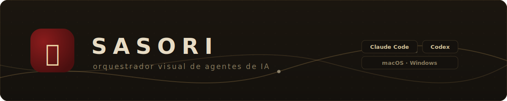
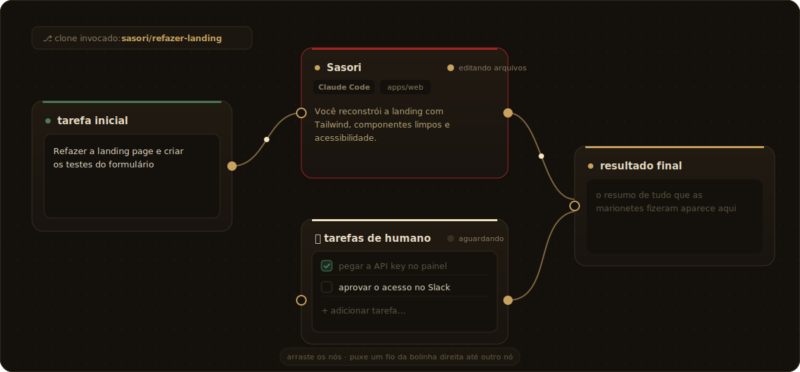
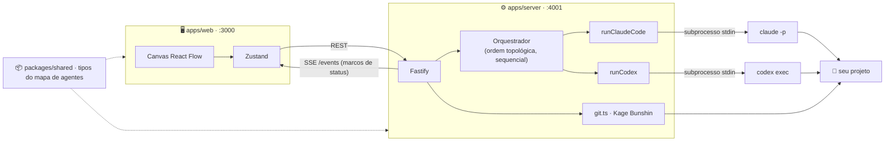

<div align="center">



**Monte marionetes de IA num canvas, puxe os fios, e deixe elas programarem por você.**

[](https://nodejs.org)
[](https://www.typescriptlang.org)
[](https://nextjs.org)
[](https://reactflow.dev)
[](#-começando)

</div>

---

O **Sasori** é um orquestrador visual de agentes de IA para desenvolvimento de código.
Você desenha um fluxo num canvas — cada nó é um agente com papel, instrução e ferramenta
próprios — e conecta os nós com *fios de chakra* que definem a ordem. Ao executar, cada
agente dispara o **Claude Code** ou o **Codex** em modo não-interativo, direto na pasta do
SEU projeto, lendo/criando/editando arquivos e rodando comandos de verdade.



## ✨ O que ele faz

- 🎨 **Canvas visual** — arraste nós, puxe fios, zoom e minimapa (React Flow).
- 🎭 **Agentes 100% editáveis** — papel, instrução (system prompt), ferramenta
  (Claude Code / Codex) e escopo (subpasta permitida) por agente.
- 📦 **Agentes prontos de qualquer pasta** — além de `~/.claude/agents` e
  `<projeto>/.claude/agents`, aponte QUALQUER pasta com `.md` de agentes e reuse os seus.
- 🙋 **Tarefas de humano** — um bloco de anotações com checklist; o fluxo **pausa** ali até
  você concluir o que só um humano pode fazer (API key, aprovação…) e clicar em continuar.
- 📡 **Status em tempo real** — cada nó pulsa com o marco atual via SSE:
  `iniciando → planejando → editando arquivos → rodando comandos → concluído`.
- 🗣 **Painel "Ombro"** — resumo curto do que cada agente fez + próximo passo sugerido.
- 🌪 **Kage Bunshin (rede de segurança Git)** — os agentes trabalham numa branch clone;
  você decide se traz de volta (merge) ou dispersa (apaga). Nada acontece sem confirmação.
- 💾 **Sem banco** — canvases salvos em JSON local (`~/.sasori/flows/`), com autosave.

## 🚀 Começando

| Pré-requisito | Para quê |
|---|---|
| [Node.js](https://nodejs.org) ≥ 20 | rodar front e server |
| [Git](https://git-scm.com) | rede de segurança (branches) |
| [Claude Code](https://claude.com/claude-code) logado (`claude` no PATH) | ferramenta de agente |
| [Codex](https://openai.com/codex) logado (`codex` no PATH) | ferramenta de agente |

> Basta **uma** das duas CLIs — a UI mostra o que detectou. Binário fora do PATH?
> Use `SASORI_CLAUDE_BIN` / `SASORI_CODEX_BIN`.

```bash
git clone <este-repo> && cd sasori
npm install
npm run dev
```

Abra **http://localhost:3000** — o server sobe junto na porta **4001**.

## 🎮 Como usar

1. **📁 Selecionar pasta do projeto** — navegue pelo disco ou cole o caminho absoluto
   (`/Users/voce/meu-app` ou `C:\Users\voce\meu-app`).
2. **🎭 Monte as marionetes** — `+ agente` cria um nó; clique nele para abrir o inspetor e
   editar tudo. Ou selecione um **agente pronto** (o botão *"buscar agentes em outra
   pasta…"* deixa você apontar onde estão os seus).
3. **🙋 Tarefas de humano** — `+ humano` adiciona o bloco de checklist onde o fluxo pausa.
4. **🕸 Conecte os fios** — bolinha direita de um nó → nó seguinte. Execução sequencial,
   a saída de cada agente vira contexto do próximo.
5. **▶ Executar fluxo** — escreva a tarefa no nó verde e rode. Antes de começar, o Sasori
   oferece **invocar um clone** (branch `sasori/<tarefa>`); ao final, **trazer de volta**
   (merge) ou **dispersar** (apagar), sempre com a sua confirmação. Pasta sem Git? Ele
   avisa e oferece `git init`.

## 🧠 Os nós

| Nó | Cor | O que faz |
|---|---|---|
| 🟢 tarefa inicial | verde | a missão que você escreve |
| 🔴 agente | vermelho | dispara Claude Code/Codex com papel + instrução + escopo |
| 🟡 tarefas de humano | areia | checklist que **pausa** o fluxo até você continuar |
| 🟠 resultado final | dourado | recebe a saída da última marionete |

## 🏗 Arquitetura



```
sasori/
├── apps/web/           Next.js 15 + React Flow + Zustand + Tailwind v4 — o canvas
├── apps/server/        Fastify — subprocessos, SSE, Git
│   └── src/agents/     runClaudeCode.ts · runCodex.ts (interface comum, plugável)
└── packages/shared/    tipos TypeScript compartilhados (nós, fios, eventos)
```

## ⚙️ Configuração

| Variável | Efeito |
|---|---|
| `SASORI_PORT` | porta do server (padrão `4001`) |
| `SASORI_CLAUDE_BIN` | caminho custom do binário `claude` |
| `SASORI_CODEX_BIN` | caminho custom do binário `codex` |

O Claude Code roda com `--dangerously-skip-permissions` para editar e rodar comandos sem
prompt (por isso a rede de segurança Git existe 🙂). Prefere travar comandos shell? Troque
por `--permission-mode acceptEdits` em [`runClaudeCode.ts`](apps/server/src/agents/runClaudeCode.ts).

## 🔧 Problemas comuns

- **"CLI não detectada"** — confira `claude --version` / `codex --version` no seu terminal;
  se funcionam mas o Sasori não vê, o PATH do processo difere: use as variáveis acima.
- **Nada acontece ao executar** — selecione a pasta do projeto e escreva a tarefa no nó verde.
- **Fluxo com ciclo** — o Sasori recusa fios circulares; desfaça o laço.

## 🗺 Roadmap (v2)

- ⚡ Execução paralela de ramos independentes
- 🏢 "Andares": cópia isolada do projeto por agente (adeus conflito de arquivo)

---

<div align="center"><sub>糸 · as marionetes não se movem sozinhas — alguém puxa os fios</sub></div>
