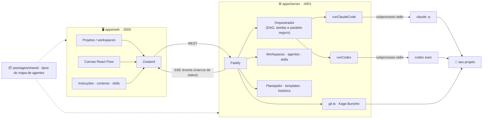

<div align="center">


**Monte marionetes de IA num canvas, puxe os fios, e deixe elas programarem por você.**

[](https://nodejs.org)
[](https://www.typescriptlang.org)
[](https://nextjs.org)
[](https://reactflow.dev)
[](#-começando)

</div>

---

O **Marionette** é um orquestrador visual de agentes de IA para desenvolvimento de código.
Você desenha um fluxo num canvas — cada nó é um agente com papel, instrução e ferramenta
próprios — e conecta os nós com *fios de chakra* que definem a ordem. Ao executar, cada
agente dispara o **Claude Code** ou o **Codex** em modo não-interativo, direto na pasta do
SEU projeto, lendo/criando/editando arquivos e rodando comandos de verdade.


## ✨ O que ele faz

- 🎨 **Canvas visual** — arraste nós, puxe fios, zoom e minimapa (React Flow).
- 🗂 **Vários projetos** — barra lateral recolhível para adicionar projetos e alternar
  instantaneamente entre o canvas e os agentes de cada workspace.
- 🎭 **Agentes 100% editáveis** — papel, instrução (system prompt), ferramenta
  (Claude Code / Codex), escopo, contexto Markdown e procedimentos por agente.
- 📦 **Agentes prontos de qualquer pasta** — além de `~/.claude/agents` e
  `<projeto>/.claude/agents`, aponte QUALQUER pasta com `.md` de agentes e reuse os seus.
- 🧩 **Skills reutilizáveis** — descubra `SKILL.md` globais ou do projeto, selecione quais
  acompanham cada agente e inclua seu conteúdo automaticamente na execução.
- 🧠 **Planejamento em tarefas** — gere um plano estruturado, revise tarefas, defina dependências
  e distribua automaticamente cada item ao agente mais adequado.
- ⚡ **Paralelismo seguro** — tarefas independentes rodam em Git worktrees quando possível e
  seus commits são integrados com controle de conflitos.
- 📚 **Central de recursos** — gerencie skills, salve presets, aplique modelos e consulte o
  histórico de cada projeto.
- 🙋 **Tarefas de humano** — um bloco de anotações com checklist; o fluxo **pausa** ali até
  você concluir o que só um humano pode fazer (API key, aprovação…) e clicar em continuar.
- 📡 **Status em tempo real** — cada nó pulsa com o marco atual via SSE:
  `iniciando → planejando → editando arquivos → rodando comandos → concluído`.
- 🗣 **Painel "Ombro"** — resumo curto do que cada agente fez + próximo passo sugerido.
- 🌪 **Kage Bunshin (rede de segurança Git)** — os agentes trabalham numa branch clone;
  você decide se traz de volta (merge) ou dispersa (apaga). Nada acontece sem confirmação.
- 💾 **Sem banco** — workspaces e canvases salvos em JSON local (`~/.marionette/`), com autosave.
- 🌗 **Dark & light** — tema Suna de noite ou de dia, com um clique (sol/lua na barra).

## 🚀 Começando

| Pré-requisito | Para quê |
|---|---|
| [Node.js](https://nodejs.org) ≥ 20 | rodar front e server |
| [Git](https://git-scm.com) | rede de segurança (branches) |
| [Claude Code](https://claude.com/claude-code) instalado e logado | ferramenta de agente |
| [Codex](https://openai.com/codex) instalado e logado | ferramenta de agente |

> Basta **uma** das duas CLIs — a UI mostra o que detectou. O Marionette procura no `PATH` e
> nos locais comuns de instalação. Para um caminho incomum, use
> `MARIONETTE_CLAUDE_BIN` / `MARIONETTE_CODEX_BIN`.

```bash
git clone <este-repo> && cd sasori
npm install
npm run dev
```

Abra **http://localhost:3000** — o server sobe junto na porta **4001**.

## 🎮 Como usar

1. **📁 Adicione um projeto** — use o botão de pasta na barra lateral, navegue pelo disco ou
   cole o caminho absoluto (`/Users/voce/meu-app` ou `C:\Users\voce\meu-app`). Cada projeto
   mantém seu próprio canvas. Clique em outro projeto para trocar rapidamente; a lixeira só
   remove o atalho do Marionette, nunca os arquivos do projeto.
2. **🎭 Monte as marionetes** — `+ agente` cria um nó; clique nele para abrir o inspetor e
   editar instruções, contexto e skills. Ou selecione um **agente pronto** (o botão
   *"buscar agentes em outra pasta…"* deixa você apontar onde estão os seus).
3. **🙋 Tarefas de humano** — `+ humano` adiciona o bloco de checklist onde o fluxo pausa.
4. **🕸 Conecte os fios** — bolinha direita de um nó → nó seguinte. Execução sequencial,
   a saída de cada agente vira contexto do próximo.
5. **▶ Executar fluxo** — escreva a tarefa no nó verde e rode. Antes de começar, o Marionette
   oferece **invocar um clone** (branch `marionette/<tarefa>`); ao final, **trazer de volta**
   (merge) ou **dispersar** (apagar), sempre com a sua confirmação. Pasta sem Git? Ele
   avisa e oferece `git init`.
6. **🧠 Planejar antes de executar** — adicione o nó **tarefas**, escreva um objetivo ou use a
   tarefa inicial e clique em **gerar tarefas**. Revise responsáveis e dependências antes de
   executar.
7. **📚 Abrir a biblioteca** — use **biblioteca** na barra superior para editar skills, salvar o
   agente atual como preset, aplicar um modelo pronto ou restaurar/repetir uma execução.

## 🧩 Agentes, contexto e skills

Cada agente possui três áreas no inspetor:

- **Instruções** — nome/papel, prompt principal, Claude Code ou Codex e subpasta permitida.
- **Contexto** — Markdown com requisitos, decisões e arquivos importantes daquele agente.
- **Skills** — procedimentos curtos escritos no próprio agente e skills reutilizáveis marcadas
  na biblioteca do workspace.

O Marionette procura arquivos no formato `<pasta-da-skill>/SKILL.md` nestas fontes:

```text
~/.marionette/skills/       globais do Marionette
~/.claude/skills/           globais do Claude
~/.codex/skills/            globais do Codex
<projeto>/.marionette/skills/
<projeto>/.claude/skills/
<projeto>/.codex/skills/
```

As skills selecionadas ficam salvas no canvas do projeto e entram no contexto somente do
agente que as recebeu. Para controlar o tamanho do prompt, cada execução carrega no máximo
oito skills e até 12 mil caracteres por arquivo.

## 🧠 Tarefas, dependências e paralelismo

O nó de tarefas transforma um objetivo em itens com título, descrição, responsável e dependências.
Os estados são `bloqueada`, `pronta`, `executando`, `concluída` e `falhou`. Agentes sem dependências
entre si podem executar em paralelo. Em um repositório Git limpo, cada ramo paralelo recebe uma
worktree temporária em `~/.marionette/worktrees/`; ao terminar, o Marionette cria um commit e
integra os ramos na branch atual. Se o projeto não tiver Git ou tiver alterações locais, usa
execução sequencial para evitar sobrescrever trabalho existente.

## 📚 Histórico e modelos

O botão **biblioteca** abre quatro áreas:

- **Skills** — criar, visualizar, editar e remover skills gerenciadas pelo Marionette.
- **Agentes** — salvar o agente atual como preset global ou específico do projeto.
- **Modelos** — desenvolvimento completo, revisão de código e correção de bug.
- **Histórico** — snapshots com logs, resumos, resultados, restauração do fluxo e repetição.

## 🧠 Os nós

| Nó | Cor | O que faz |
|---|---|---|
| 🟢 tarefa inicial | verde | a missão que você escreve |
| 🟤 plano de tarefas | areia escura | gera, distribui e acompanha tarefas com dependências |
| 🔴 agente | vermelho | dispara Claude Code/Codex com papel + instrução + escopo |
| 🟡 tarefas de humano | areia | checklist que **pausa** o fluxo até você continuar |
| 🟠 resultado final | dourado | recebe a saída da última marionete |

## 🏗 Arquitetura



```
marionette/
├── apps/web/           Next.js 15 + React Flow + Zustand + Tailwind v4 — o canvas
├── apps/server/        Fastify — subprocessos, SSE, Git
│   └── src/agents/     runClaudeCode.ts · runCodex.ts (interface comum, plugável)
└── packages/shared/    tipos TypeScript compartilhados (nós, fios, eventos)
```

## ⚙️ Configuração

| Variável | Efeito |
|---|---|
| `MARIONETTE_PORT` | porta do server (padrão `4001`) |
| `MARIONETTE_CLAUDE_BIN` | caminho custom do binário `claude` |
| `MARIONETTE_CODEX_BIN` | caminho custom do binário `codex` |

O Claude Code roda com `--dangerously-skip-permissions` para editar e rodar comandos sem
prompt (por isso a rede de segurança Git existe 🙂). Prefere travar comandos shell? Troque
por `--permission-mode acceptEdits` em [`runClaudeCode.ts`](apps/server/src/agents/runClaudeCode.ts).

## 🔧 Problemas comuns

- **"CLI não detectada"** — confira `claude --version` / `codex --version` no seu terminal;
  reinicie o servidor para refazer a detecção. O Marionette procura automaticamente em
  `~/.local/bin`, `~/.npm-global/bin`, Homebrew e `/usr/local/bin`; para outro local, use as
  variáveis acima.
- **Nada acontece ao executar** — selecione a pasta do projeto e escreva a tarefa no nó verde.
- **Fluxo com ciclo** — o Marionette recusa fios circulares; desfaça o laço.

## 🗺 Próximas evoluções

- 🔐 Aprovação por tarefa antes de integrar worktrees
- 🧪 Testes automatizados do agendador e resolução de conflitos
- 🌐 Execução remota opcional para projetos maiores

---

<div align="center"><sub>糸 · as marionetes não se movem sozinhas — alguém puxa os fios</sub></div>
